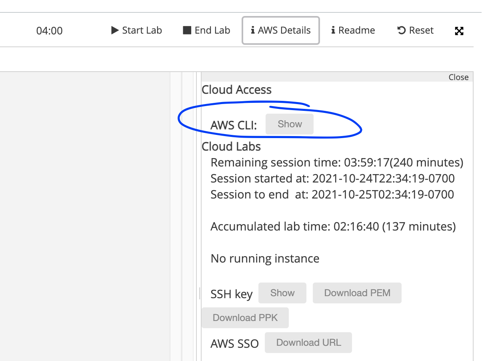

# Boto library demo

This little project demonstrates the use of the boto python library to interact with the AWS API.

At present it utilises the EC2 endpoint to launch 1 Amazon AMI instance. It has been tested with t2.micro instances.

You should be familiar with python prior to starting this tutorial. AWS API wrappers are available for other programming
languages as well.

## Prerequisites

- [ ] python >3.6 (we recommend to use pyenv to manage python installations on linux/Mac)
- [ ] AWS CLI session secrets
  

### Setup Python Dependencies

- [ ] create a new virtual environment
- [ ] run `pip install -r requirements.txt`

## Configure EC2 instances

- [ ] move `.env.template` to `.env`
- [ ] edit `.env` and paste your AWS session details

run `fab create`. This will use the fabric cli runner to run the create task. 

See the [zookeeper tutorial](https://github.com/ccdb-uob/zookeeper_tutorial/blob/691870afaa28155324aebde7bfb78efd41bd9001/start_zk_cluster.py#L23)
for an example of how to use fabric to script deployments of application code on remote servers.

To prepare machines for the zookeeper tutorial run
```bash
fab create --name zk --securitygroup sg-0f8c026df0032d5c1 
fab create --name zk --securitygroup sg-0f8c026df0032d5c1 
fab create --name zk --securitygroup sg-0f8c026df0032d5c1 
```

the 
`fab instancedetails --name zk`

And copy the ip address pairs at the end of the output
```bash
INFO:fabfile:Instance up and running at ec2-52-55-249-15.compute-1.amazonaws.com with internal ip 172.31.45.4: 52.55.249.15: 172.31.45.4
INFO:fabfile:Instance up and running at ec2-18-232-78-191.compute-1.amazonaws.com with internal ip 172.31.39.236: 18.232.78.191: 172.31.39.236
INFO:fabfile:Instance up and running at ec2-54-224-224-79.compute-1.amazonaws.com with internal ip 172.31.32.31: 54.224.224.79: 172.31.32.31
```
into the `config.yaml` file
```yaml
  52.55.249.15: 172.31.45.4
  18.232.78.191: 172.31.39.236
  54.224.224.79: 172.31.32.31
```

You should see a lot of boto debug output. The last line should include your instance id and look similar to this:


**Congratulations** You now have a running EC2 instance. Check in the EC2 concole to confirm.

Stretch goals:

- [ ] create a second and third fab target that checks the instance state and terminates it. 

 